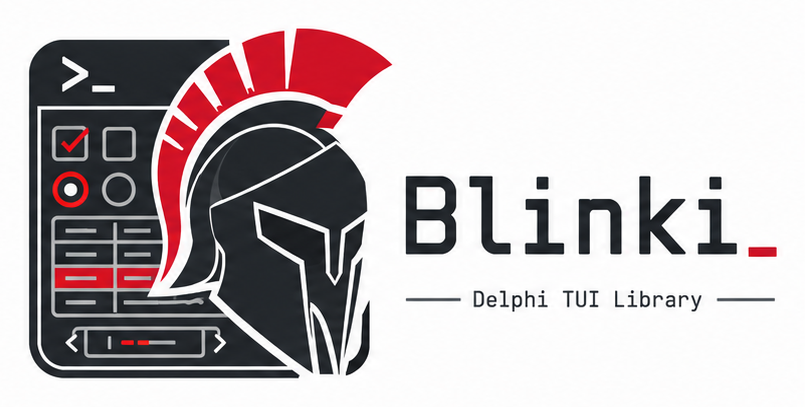
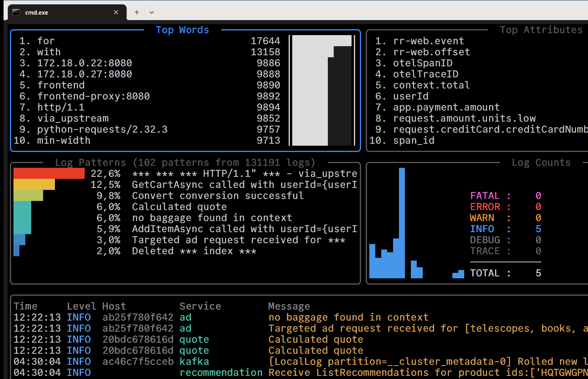
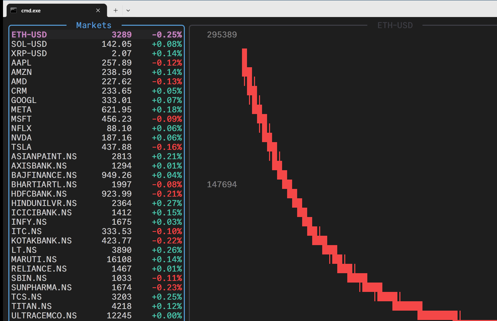
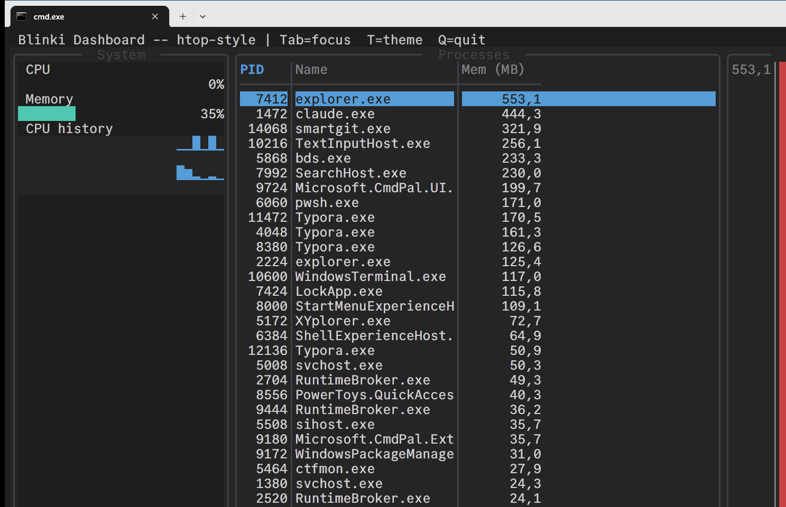
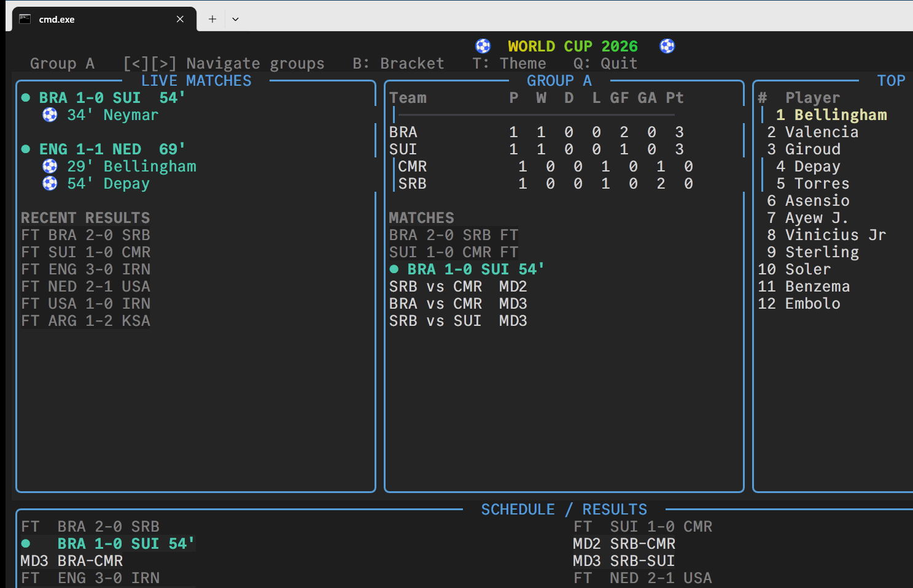
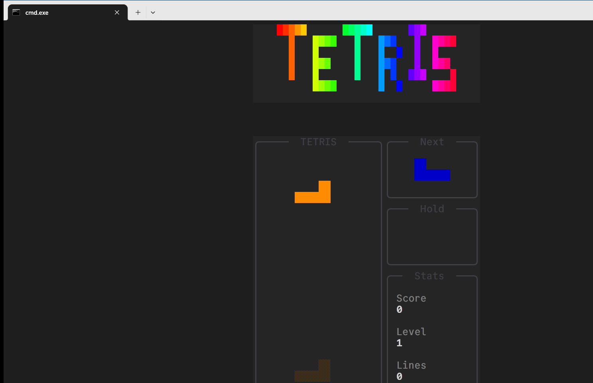
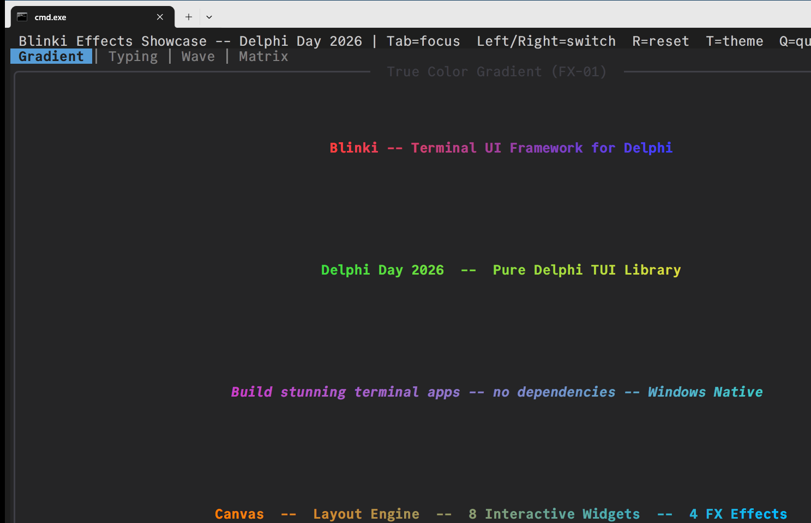

<div align="center">

<picture>
  <source media="(prefers-color-scheme: dark)" srcset="Assets/logo-blinki-dark.png">
  <source media="(prefers-color-scheme: light)" srcset="Assets/logo-blinki-light.png">
  
</picture>

### A pure-Delphi TUI framework for building rich, modern terminal applications on Windows.

[](LICENSE)
[](https://www.embarcadero.com/products/delphi)
[](#requirements)
[](#)
[](#installation)

</div>

> *"Blinki"* evokes the **blink** — the pulse of the cursor and the living animation that brings
> text interfaces to life. Every app built with Blinki turns the terminal into a dynamic surface
> of characters that update, blink, and come alive.

---

## Demo Gallery

Sixteen complete demo applications live under [`Demos\`](Demos) and are aggregated by
`Demos\Blinki.Demos.groupproj`. A selection of the highlights:

<table>
<tr>
<td width="50%">

**Dashboard** — log analytics with a custom data table, bar charts, sparklines and severity-colored overlays.



</td>
<td width="50%">

**CryptoTracker** — a real-time market watchlist with a live candlestick chart.



</td>
</tr>
<tr>
<td width="50%">

**SysMonitor** — an htop-style system monitor: CPU/memory gauges, history sparklines, process table.



</td>
<td width="50%">

**WorldCup** — a dense live-sports dashboard with groups, standings, schedule and gradient FX.



</td>
</tr>
<tr>
<td width="50%">

**Tetris** — a full real-time game with SRS rotation, 7-bag randomizer and a colorful logo.



</td>
<td width="50%">

**EffectsShowcase** — gradient banners, typing animation, color waves and Matrix rain on tabbed pages.



</td>
</tr>
</table>

> The full set also includes **Kanban**, **TeamChat**, **TaskManager**, **FileManager**,
> **DataViewer**, **Form**, **ResTui**, **Recorder**, **Scaffold**, and **DelphiDay**. Press
> **T** in any demo to hot-toggle the Dark/Light theme.

---

## Why Blinki

Blinki lets you build beautiful, keyboard-driven terminal UIs in **plain Delphi** — with **no
external dependencies, no DLLs, no design-time components, and no package to install**. Add the
`Source\` folder to your project's unit search path, `uses` what you need, and you're done.

- 🎨 **Looks good by default** — semantic theming (Dark/Light), 24-bit true-color, and Unicode
  box-drawing with rounded/double/heavy borders.
- 😀 **Extended emoji support** — grapheme-cluster aware rendering, measurement, and editing:
  astral-plane emoji, ZWJ sequences (👨‍👩‍👧), skin tones (👍🏽), flags (🇮🇹), and variation
  selectors (☀️) render as single, correctly-sized glyphs. A `:shortcode:` catalog
  (`TTuiEmoji.Expand('deploy :rocket:')`) is included, and width rules adapt automatically to
  the terminal's capabilities (`TTuiUnicode.EmojiLevel`).
- 🧩 **24 built-in widgets** across six categories — from labels and buttons to tables, charts,
  dialogs, and animated effects.
- 📐 **Constraint-based layout engine** — `VStack`, `HStack`, `Grid`, and `Scrollable` containers
  with `Fixed` / `Fill` / `Min` / `Max` / `Percentage` sizing.
- ⚡ **Flicker-free rendering** — a double-buffered canvas that diffs cell-by-cell and emits a
  single batched ANSI write per frame.
- ⌨️ **Automatic focus ring** — Tab / Shift+Tab navigation handled for you; widgets just declare
  themselves focusable.
- 🪟 **Native Windows console, 🐧 Linux too** — Windows builds directly on the Win32 console
  API and Virtual Terminal sequences; Linux64 builds on termios raw mode, `poll(2)` and a
  fully unit-tested escape-sequence decoder (arrow keys, F-keys, Shift+Tab, SGR mouse,
  UTF-8 input). All platform code is quarantined behind a single interface seam — to build
  for Linux, enable the Linux64 platform on your project in the IDE and deploy via PAServer.
- 🧱 **Easy to extend** — descend from `TTuiWidget`, override `DoRender`, and you have a new widget.

---

## Quick Start

```pascal
program Greeter;

{$APPTYPE CONSOLE}

uses
  System.SysUtils,
  Blinki.Core.App,
  Blinki.Core.Input,
  Blinki.Core.Geometry,
  Blinki.Widgets.Labels,
  Blinki.Widgets.Box,
  Blinki.Widgets.TextInput,
  Blinki.Widgets.Button,
  Blinki.Layout.Stack;

begin
  var LApp := TTuiApp.Create;
  var LRoot := TTuiVStack.Create;
  try
    // Bordered "Greeter" box around the form
    var LBox := TTuiBox.Create(LRoot);
    LBox.Title := ' Greeter ';
    LBox.LayoutConstraint := TTuiLayoutConstraint.Fixed(6);

    var LForm := TTuiVStack.Create(LBox);

    // "Name:" label + text input on the same row
    var LRow := TTuiHStack.Create(LForm);
    LRow.LayoutConstraint := TTuiLayoutConstraint.Fixed(1);

    var LPrompt := TTuiLabel.Create(LRow);
    LPrompt.Text := ' Name: ';
    LPrompt.LayoutConstraint := TTuiLayoutConstraint.Fixed(8);

    var LInput := TTuiTextInput.Create(LRow);
    LInput.Placeholder := 'type your name...';
    LInput.LayoutConstraint := TTuiLayoutConstraint.Fill(1);

    // The action button
    var LButton := TTuiButton.Create(LForm);
    LButton.Caption := 'Greet';
    LButton.LayoutConstraint := TTuiLayoutConstraint.Fixed(1);

    // Result line below the box
    var LResult := TTuiLabel.Create(LRoot);
    LResult.Text := ' Tab to move focus, Enter/Space to Greet, Esc to quit.';
    LResult.LayoutConstraint := TTuiLayoutConstraint.Fixed(1);

    // One shared action, wired to both the button click and Enter in the field.
    // The closure captures the widgets above by reference.
    var LGreet: TProc :=
      procedure
      begin
        if LInput.Text = '' then
          LResult.Text := ' Please type your name first.'
        else
          LResult.Text := ' Hello, ' + LInput.Text + '!';
      end;
    LButton.OnClick := LGreet;
    LInput.OnSubmit :=
      procedure(AText: string)
      begin
        LGreet();
      end;

    LApp.SetRoot(LRoot);
    LApp.OnKeyPress :=
      procedure(const AKey: TTuiKeyEvent)
      begin
        if AKey.Code = kcEscape then
          LApp.Quit;
      end;
    LApp.Run;
  finally
    LApp.Free; // also frees the widget tree it owns
  end;
end.
```

This example builds a small interactive form in ~70 lines. Type a name, press **Tab** to move
focus to the button, then **Enter** or **Space** to activate it — the label below the box updates
with the greeting. Three pillars of Blinki in one go:

- **Layout** — a `TTuiBox` border wraps a `VStack`/`HStack` sized with `LayoutConstraint`.
- **Automatic focus ring** — Tab/Shift+Tab cycle between the input and the button with no extra code.
- **Events** — `OnClick` and `OnSubmit` read `LInput.Text` and update the label via a shared closure.

> **Note:** Blinki has no built-in quit key by design — the host wires `OnKeyPress` to call `Quit`.

> [!TIP]
> For more real-world inspiration, browse the **16 demo apps** under [`Demos\`](Demos) and the
> **11 smoke tests** under [`Tests\SmokeTests\`](Tests/SmokeTests). Each demo is a self-contained
> `.dpr` that covers a specific UI pattern — dashboards, data tables, forms, games, effects — and
> every smoke test isolates a single framework layer with clear pass/fail output. Both are good
> starting points when you want to see how a particular widget or layout is wired up in practice.

---

## Installation

Below you will find all the instructions to install and start using the library in your projects.

### Basic setup

1. Clone or download this repository.
2. In your Delphi project options, add `<repo>\Source` to the **Unit Search Path**.
3. Add the units you need to your `uses` clause.

That's it — all source units are plain `.pas` files, with no generated code, no design-time
components, and no IDE integration required.

### Installing with Blocks (package manager)

Prefer a package manager? Blinki is published in the official [Blocks community repository](https://github.com/delphi-blocks/blocks-repository) as `marcobreveglieri.blinki`.

[Blocks](https://github.com/delphi-blocks/blocks) downloads, compiles, and wires versioned Delphi packages into your IDE for you.

```bat
:: Install the Blocks CLI once (requires Windows + winget)
winget install DelphiBlocks.Blocks

:: From your project folder: initialize the workspace and pick your Delphi version
blocks init

:: Add Blinki to the project
blocks install marcobreveglieri.blinki
```

Blocks fetches the sources, compiles the `Blinki` runtime package with MSBuild, and registers the library and search paths in your IDE — then just `uses` the units you need.

> [!TIP]
>
> To pin a specific release, append a SemVer constraint, e.g. `blocks install marcobreveglieri.blinki@^0.1.0`.

---

## Widget Catalog

Blinki ships **24 built-in widgets** organized into six categories.

### Text & Static

| Widget | Unit | Description |
|--------|------|-------------|
| `TTuiLabel` | `Blinki.Widgets.Labels` | Single-line static or dynamic text |
| `TTuiBox` | `Blinki.Widgets.Box` | Bordered container around a single child |

### Interactive Input

| Widget | Unit | Description |
|--------|------|-------------|
| `TTuiButton` | `Blinki.Widgets.Button` | Keyboard-activated button (Enter/Space) |
| `TTuiCheckbox` | `Blinki.Widgets.Checkbox` | Toggleable checkbox |
| `TTuiRadioButton` | `Blinki.Widgets.RadioButton` | Mutually-exclusive option in a group |
| `TTuiTextInput` | `Blinki.Widgets.TextInput` | Single-line field with cursor, placeholder, password masking |
| `TTuiTextArea` | `Blinki.Widgets.TextArea` | Multi-line text editor with auto-scroll |
| `TTuiSelect` | `Blinki.Widgets.Select` | Dropdown / combo selection list |
| `TTuiMenu` | `Blinki.Widgets.Menu` | Keyboard-navigable menu with shortcuts |

### Navigation & Containers

| Widget | Unit | Description |
|--------|------|-------------|
| `TTuiTabs` | `Blinki.Widgets.Tabs` | Tabbed pages with Left/Right navigation |
| `TTuiSidebar` | `Blinki.Widgets.Sidebar` | Collapsible side panel |

### Data & Display

| Widget | Unit | Description |
|--------|------|-------------|
| `TTuiTable` | `Blinki.Widgets.Table` | Scrollable, sortable data table with header |
| `TTuiBadge` | `Blinki.Widgets.Badge` | Compact colored status label |
| `TTuiProgressBar` | `Blinki.Widgets.ProgressBar` | Animated progress bar |
| `TTuiGauge` | `Blinki.Widgets.Gauge` | Animated gauge with threshold-based colors |
| `TTuiBarChart` | `Blinki.Widgets.BarChart` | Vertical bar chart with Y-axis and labels |
| `TTuiSparkline` | `Blinki.Widgets.Sparkline` | Rolling mini trend chart |
| `TTuiAlert` | `Blinki.Widgets.Alert` | Semantic message banner (info/success/warning/error) |

### Feedback & Overlays

| Widget | Unit | Description |
|--------|------|-------------|
| `TTuiToast` | `Blinki.Widgets.Toast` | Auto-dismissing transient notification |
| `TTuiDialog` | `Blinki.Widgets.Dialog` | Modal dialog (plus `TTuiInputDialog` / `TTuiProgressDialog`) |
| `TTuiSpinner` | `Blinki.Widgets.Spinner` | Animated activity indicator (5 styles) |

### FX & Animation

| Widget | Unit | Description |
|--------|------|-------------|
| `TTuiTypingEffect` | `Blinki.Widgets.TypingEffect` | Character-by-character text reveal |
| `TTuiWaveAnimation` | `Blinki.Widgets.WaveAnimation` | Sinusoidal color wave over text |
| `TTuiMatrixRain` | `Blinki.Widgets.MatrixRain` | Full-area Matrix-style digital rain |

### Layout & Effects

| Component | Unit | Description |
|-----------|------|-------------|
| `TTuiVStack` / `TTuiHStack` | `Blinki.Layout.Stack` | Vertical / horizontal proportional stacks |
| `TTuiGrid` | `Blinki.Layout.Grid` | Row/column grid container |
| `TTuiScrollable` | `Blinki.Layout.Scrollable` | Scrollable viewport |
| `DrawGradient` | `Blinki.FX.Gradient` | True-color horizontal gradient on a text string |

---

## Testing

Testing happens on two layers, both under `Tests\`:

- **Unit tests (DUnitX)** — `Tests\UnitTests\BlinkiUnitTests.dproj` is a console runner that
  executes the `[TestFixture]` suites and exits with code `0` when every test passes.
- **Smoke tests** — `Tests\SmokeTests\Blinki.SmokeTests.groupproj` bundles the runtime package plus
  11 standalone apps, each exercising one layer of the framework and printing pass/fail criteria.

---

## Requirements

| Requirement | Version |
|-------------|---------|
| Delphi | 13.1 Florence or later |
| Target platform | Win32 (32-bit console) |
| Windows | Windows 10 build 10586 (v1511) or later |
| Terminal | Windows Terminal (recommended) or ConHost |

> True-color gradients require a terminal with 24-bit color support. Windows Terminal supports this
> out of the box; ConHost requires Windows 10 v1903 or later. Source units are also annotated with
> `{$IFDEF FPC}{$MODE DELPHI}{$ENDIF}` for FreePascal compatibility.

---

## Architecture

Blinki is strictly layered, with **all platform-specific code quarantined behind a single console
interface** — the `App`, `Widget`, `Canvas`, and rendering layers are 100% platform-agnostic.

```
Blinki.Core.*        Canvas, event loop, input, widget base class, theme, ANSI, geometry
Blinki.Layout.*      Constraint-based VStack / HStack / Grid / Scrollable solvers
Blinki.Widgets.*     All 24 widget implementations
Blinki.FX.*          Visual effects helpers (gradient, etc.)
Demos\               16 demo applications (not part of the library)
Tests\SmokeTests\    Per-layer smoke tests + Blinki.SmokeTests.groupproj
Tests\UnitTests\     DUnitX unit tests (BlinkiUnitTests.dproj)
```

For the full story — the event loop, the rendering pipeline, the widget contract, and the Win32
API surface — see the [Architecture & Advanced Usage](https://github.com/marcobreveglieri/blinki/wiki/Architecture-and-Advanced-Usage) wiki page.

---

## Documentation

The **project Wiki** covers installation, a from-scratch first TUI, the internal architecture,
and how to contribute:

- [Home](https://github.com/marcobreveglieri/blinki/wiki)
- [Getting Started](https://github.com/marcobreveglieri/blinki/wiki/Getting-Started)
- [Architecture & Advanced Usage](https://github.com/marcobreveglieri/blinki/wiki/Architecture-and-Advanced-Usage)
- [Contributing](https://github.com/marcobreveglieri/blinki/wiki/Contributing)

The coding style is documented in [`STYLE_GUIDE.md`](STYLE_GUIDE.md).

> [!WARNING]
> **Blinki is highly experimental and under active, heavy development**. Breaking changes are expected at any time as the library undergoes a massive refactoring to reach high production quality. Planned work includes new widgets, comprehensive documentation, and an in-depth code review pass.
> Use it for experimentation and learning, but **no warranty of any kind is provided**.

---

## License

Blinki is released under the **MIT License** — Copyright © 2026 Marco Breveglieri.
See [LICENSE](LICENSE) for the full text.
